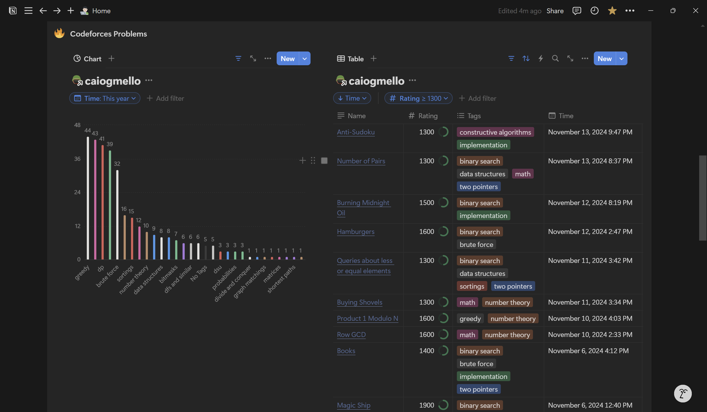

# API Integration: Codeforces ↔ Notion Database

This project integrates [Codeforces](https://codeforces.com/) with [Notion](https://notion.so/), allowing you to visualize your solved problems and create interactive views for analysis.


 

## Setup Instructions
### 1. Create a [Notion Integration](https://www.notion.so/profile/integrations)

1. Make sure you have a Notion account.
2. Go to [Notion Integrations](https://www.notion.so/profile/integrations) and create a new integration.

    - Give it a name of your choice.
    - Select the Internal integration type.
3. Save the Integration Token — it will be used later.

### 2. Create the Parent Page

Create a new page in your Notion workspace to store your Codeforces submissions database.
- Place it anywhere in your workspace and name it as you prefer.
- Ensure the page is private:


### 3. Connect the Integration

1. Open the options of the page you created and connect it to your Notion integration.


2. Copy the Parent Page URL using the Share button. You'll need this URL later.

## Running the Code
### Prerequisites

Ensure ` Python 3.8 ` or later is installed on your computer.

### Installation

1. Navigate to the project's root directory.
2. Install dependencies:
```bash
    pip install -r requirements.txt
```

### Execution

Run the following command to execute the script:

```bash
python3 main.py
```

When prompted, provide the following:

1. Your **Notion Integration Token**.
2. The **Parent Page URL**.
3. Your **Codeforces username**.

After execution, a new database will be created in your Parent Page, named after your Codeforces username. You can organize and personalize it, and even add [charts](https://www.notion.so/help/charts) for better visualization.


## Important Notes
- **Manual Updates**: You must rerun the script every time you want to update the database with new submissions.
- **Public Data Only**: The integration only retrieves publicly visible Codeforces submissions.
- **One User per Database**: Each database is linked to a single Codeforces user. For multiple users, create separate databases under the same parent page.
- **Avoid Manual Edits**: Adding rows manually in the database and editting property names and values (like the tag color) can cause issues.

## Future Improvements

- Other type of databases, like a Database that storage yours contests info like position, how many questions, score,  delta, etc.

## About the Code

This project is built using pure Python, without any additional frameworks, focusing on simplicity and efficiency. It leverages the following libraries, listed in the ``requirements.txt`` file:

- ``requests``: To make HTTP requests to the Codeforces and Notion APIs.
- ``dotenv`` (optional): To securely manage environment variables, such as API tokens.
- ``json`` (native): To process and structure the data retrieved from the APIs.

### Key Features of the Code:

Codeforces API Integration
- Fetches public submissions of solved problems from your Codeforces account.
- Filters and structures the relevant data, such as problem ID, title, and submission status.

Notion API Integration
- Connects to your custom integration to create and update databases in your Notion workspace.
- Inserts structured submission data, enabling easy organization and customization within Notion.

Simplified Execution
- The code is designed to run with a single command after the initial setup.

## Contributing and License
**Contributions to this project are more than welcome. Feel free to report a bug, suggest a improvement or submit a new feature.**

Therefore, this project is licensed under the MIT License.

You are free to use, modify, and distribute this project, provided that the original license file is included in any copies or substantial portions of the software.

For more details, refer to the [LICENSE](./LICENSE) file.